# VCF 9 Offline Depot

This guide provides comprehensive instructions for deploying a VCF 9.0 offline depot for VCF bundles and UMDS depot for vSphere updates.

## Changelog

| Date | Description |
|------|-------------|
| 20 JAN 2026 | Add VCF 9.0.2 support |
| 29 SEP 2025 | Add VCF 9.0.1 support |
| 17 JUN 2025 | Add VCF 9.0.0 support |

> [!WARNING]
> The full depot with all VCF versions (9.0.0/9.0.1/9.0.2) and UMDS updates approaches **~500 GB** of data. Ensure your disk is sized accordingly. You can extend the zBox disk using `zbox-init.sh --extend-disk` after increasing the VM disk size if needed.

## Table of Contents

- [Prerequisites](#prerequisites)
- [Setup DNS (cloudflare)](#setup-dns-cloudflare)
- [Deploy Depot VM](#deploy-depot-vm)
  - [Install zBox](#install-zbox)
  - [Install VCF Download Tool](#install-vcf-download-tool)
  - [Install VMware Update Manager (UMDS)](#install-vmware-update-manager-umds)
  - [Setup Broadcom Download Token](#setup-broadcom-download-token)
- [Download VCF Components](#download-vcf-components)
  - [Scenario 1: Installation Packages Only](#scenario-1-installation-packages-only)
  - [Scenario 2: Upgrade Packages Only](#scenario-2-upgrade-packages-only)
  - [Scenario 3: Everything (Recommended)](#scenario-3-everything-recommended)
- [Download vSphere Updates with UMDS](#download-vsphere-updates-with-umds)
- [Setting up the HTTPS Depot](#setting-up-the-https-depot)
  - [Traefik Configuration](#traefik-configuration)
  - [Depot Configuration](#depot-configuration)
- [Validating the Depot in VCF](#validating-the-depot-in-vcf)
  - [Setting up the HTTPS Depot on VCF Installer (bootstrap)](#setting-up-the-https-depot-on-vcf-installer-bootstrap)
  - [Setting up the HTTPS Depot on VCF Operations Fleet Management (post-bootstrap)](#setting-up-the-https-depot-on-vcf-operations-fleet-management-post-bootstrap)
  - [Synchronizing the ESXi Components for vSphere Updates](#synchronizing-the-esxi-components-for-vsphere-updates)
- [Adding VCF 9.0.1 Support](#adding-vcf-901-support)
  - [Updated Tooling](#updated-tooling)
  - [Download VCF 9.0.1 Components](#download-vcf-901-components)
  - [Download vSphere 9.0.1 Updates with UMDS](#download-vsphere-901-updates-with-umds)
- [Adding VCF 9.0.2 Support](#adding-vcf-902-support)
  - [Updated Tooling](#updated-tooling-1)
  - [Download VCF 9.0.2 Components](#download-vcf-902-components)
  - [Download vSphere 9.0.2 Updates with UMDS](#download-vsphere-902-updates-with-umds)


## Prerequisites

- Linux VM with at least 500GB of disk space (zBox Template for this guide)
- Domain name and HTTPS certificates
  - This deployment uses a public domain name with CloudFlare DNS challenge provider for automatic HTTPS certificate generation
- VCF Download Tool
- Broadcom download token OR [VCF 9 offline depot metadata](https://williamlam.com/2025/07/how-to-deploy-vvf-vcf-9-0-using-vmug-advantage-vcp-vcf-certification-entitlement.html)
- Broadcom entitlement for VVF or VCF Products


> [!CAUTION]
> You need to have an active Broadcom entitlement for VVF/VCF Products to download the VCF 9.0 components and/or the Broadcom download token to fetch the VCF 9.0 components.

## Setup DNS (cloudflare)

We chose Cloudflare for its simplicity and excellent DNS provider availability in Traefik, which allows us to easily generate valid SSL certificates using DNS API tokens for simplified lifecycle management.

The following DNS records need to be configured in your Cloudflare dashboard:

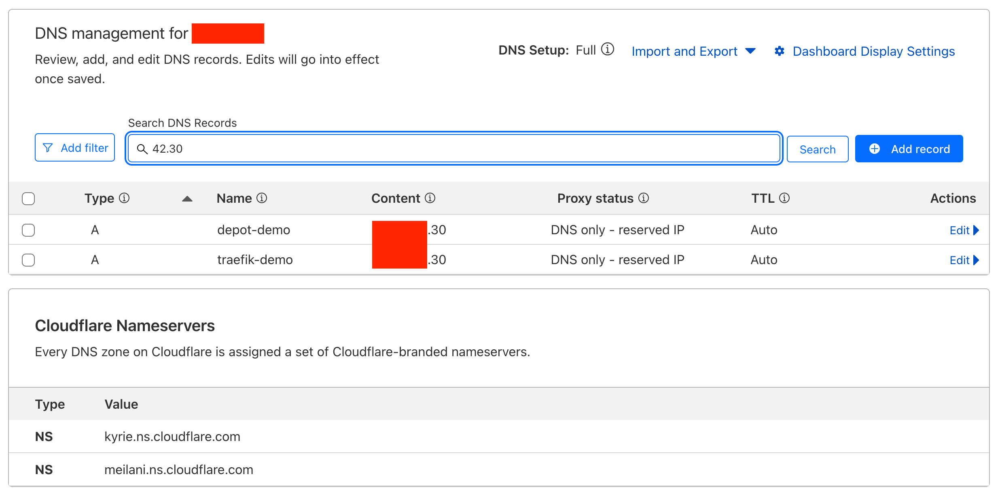

The image above shows the two DNS A records we added:
- `traefik.domain.com` → points to the depot VM IP (172.16.1.30) for Traefik dashboard access
- `depot.domain.com` → points to the depot VM IP (172.16.1.30)for the main depot endpoint


## Deploy Depot VM

### Install zBox

Use this as the base Linux template, or choose an alternative that meets your requirements. This documentation is based on zBox as the Linux appliance.

- zBox is available at: [https://github.com/zpodfactory/packer-zbox](https://github.com/zpodfactory/packer-zbox?tab=readme-ov-file#zbox-appliance)
- Direct download link: [https://cloud.tsugliani.fr/ova/zbox-13.3.ova](https://cloud.tsugliani.fr/ova/zbox-13.3.ova)


Extend the disk to 500GB (or sufficient capacity to accommodate your expected depot size; current total usage is approximately 140GB).

> [!WARNING]
> If you overlook this step, you can extend the disk later using `zbox-init.sh --extend-disk` after increasing the VM disk size.
> This command handles SCSI bus rescanning, LVM expansion, and filesystem extension, making the additional disk space immediately available in the LVM root volume group filesystem.

```shell
❱ duf .
╭───────────────────────────────────────────────────────────────────────────────────────────╮
│ 1 local device                                                                            │
├────────────┬────────┬──────┬────────┬───────────────────────────────┬──────┬──────────────┤
│ MOUNTED ON │   SIZE │ USED │  AVAIL │              USE%             │ TYPE │ FILESYSTEM   │
├────────────┼────────┼──────┼────────┼───────────────────────────────┼──────┼──────────────┤
│ /          │ 483.9G │ 2.0G │ 461.8G │ [....................]   0.4% │ ext4 │ /dev/vg/root │
╰────────────┴────────┴──────┴────────┴───────────────────────────────┴──────┴──────────────╯
```

Install Docker (this includes the docker-compose-plugin that will be used later)

```shell
❱ apt install docker-ce
Reading package lists... Done
Building dependency tree... Done
Reading state information... Done
The following additional packages will be installed:
  containerd.io docker-buildx-plugin docker-ce-cli docker-ce-rootless-extras docker-compose-plugin iptables libip6tc2 libslirp0 pigz slirp4netns
Suggested packages:
  cgroupfs-mount | cgroup-lite docker-model-plugin firewalld
The following NEW packages will be installed:
  containerd.io docker-buildx-plugin docker-ce docker-ce-cli docker-ce-rootless-extras docker-compose-plugin iptables libip6tc2 libslirp0 pigz slirp4netns
0 upgraded, 11 newly installed, 0 to remove and 0 not upgraded.
Need to get 103 MB of archives.
After this operation, 432 MB of additional disk space will be used.
Do you want to continue? [Y/n]
```

### Install VCF Download Tool

Download the VCF download tool from the [Broadcom Support Portal](https://support.broadcom.com/group/ecx/productfiles?subFamily=VMware%20Cloud%20Foundation&displayGroup=VMware%20Cloud%20Foundation%209&release=9.0.0.0&os=&servicePk=&language=EN):

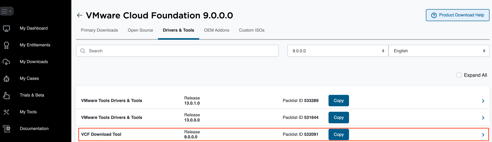


```shell
❱ tar -xvzf vcf-download-tool-9.0.0.0.24703747.tar.gz -C /usr/local
❱ rm vcf-download-tool-9.0.0.0.24703747.tar.gz
```


### Install VMware Update Manager (UMDS)


Now configure vSphere updates with UMDS:

```shell
❱ vcf-download-tool umds install # go through the installer, enable/disable CEIP, accept eula.
```

### Setup Broadcom Download Token

Now that the `vcf-download-tool` is available, prepare your Broadcom download token for use.

See [VCF authenticated downloads configuration update instructions](https://knowledge.broadcom.com/external/article/390098) for more details.


```shell
❱ echo "my-broadcom-download-token" > /etc/broadcom-token
```

> [!CAUTION]
> The download token is a secret and should be kept secure.

Now prepare the repository structure before downloading the required content.

```shell
❱ mkdir -vp /depot/umds-patch-store
mkdir: created directory '/depot'
mkdir: created directory '/depot/umds-patch-store'
❱ tree /depot
/depot
└── umds-patch-store  # This will host the UMDS updates/patches
❱
```

## Download VCF Components

Choose one of the following scenarios based on your requirements:

The three scenarios provide different levels of completeness for your VCF offline depot:

- **Scenario 1** is ideal for fresh installations only
- **Scenario 2** is suitable for existing deployments that need upgrades
- **Scenario 3** is the most comprehensive option, providing both installation and upgrade capabilities

Choose the scenario that best fits your deployment strategy and available storage capacity.

### Scenario 1: Installation Packages Only
**Use case**: Fresh VCF 9.0 installation
**Size**: ~88 GB
**Components**: 15 installation packages

```shell
❱ vcf-download-tool binaries download --vcf-version 9.0.0 --type=INSTALL --depot-store /depot --depot-download-token-file /etc/broadcom-token
```

**Example output**:
```
*********Welcome to VMware Cloud Foundation Download Tool***********

Version: 9.0.0.0.24703747
Validating depot credentials.
Depot credentials are valid.
Downloading unified release manifest file.
Successfully downloaded unified release manifest file.
Downloading product version catalog file.
Successfully downloaded product version catalog file.
Downloading vSAN HCL file.
Successfully downloaded vSAN HCL file.
Downloading compatibility data.
Successfully downloaded compatibility data.
Binaries to be downloaded:
--------------------------------------------------------------------------------------------------------------------------------------------------------------------------
ID                                   | Component           | Component Full Name                                 | Version           | Release Date | Size       | Type
--------------------------------------------------------------------------------------------------------------------------------------------------------------------------
dea0261e-b521-5691-ba2b-91439b7db89d | VRO                 | VMware Orchestrator                                 | 9.0.0.0.24674408  | 06/17/2025   |    4.3 GiB | INSTALL
6da840f4-2bc7-5c6c-af21-14c1831f29ae | VMTOOLS             | VMware Tools Async Release                          | 13.0.0.0.24696475 | 06/17/2025   |  100.0 MiB | INSTALL
1a161174-eaa6-5c63-802e-7359019fde35 | VIDB                | VMware Identity Broker                              | 9.0.0.0.24695128  | 06/17/2025   |    9.6 GiB | INSTALL
5c26160e-da27-5f3e-acda-cc29769fd44d | VRLI                | VMware Cloud Foundation Operations for logs         | 9.0.0.0.24695810  | 06/17/2025   |    1.4 GiB | INSTALL
094257b5-5b54-5199-9ebb-562c59a1f47a | NSX_T_MANAGER       | VMware NSX                                          | 9.0.0.0.24733063  | 06/17/2025   |   10.0 GiB | INSTALL
244dcbc0-d592-540c-893a-95eb07877a23 | VRA                 | VMware Cloud Foundation Automation                  | 9.0.0.0.24701403  | 06/17/2025   |   21.2 GiB | INSTALL
28ca23b6-4688-53ae-af9c-ae1d4d50d9f1 | VROPS               | VMware Cloud Foundation Operations                  | 9.0.0.0.24695812  | 06/17/2025   |    2.6 GiB | INSTALL
4c209b46-cc8a-5604-978f-70d8dc1014d3 | VRSLCM              | VMware Cloud Foundation Operations fleet management | 9.0.0.0.24695816  | 06/17/2025   |    1.5 GiB | INSTALL
be896bf9-3dae-5f65-be31-0149940a6a17 | VRNI                | VMware Cloud Foundation Operations for networks     | 9.0.0.0.24694676  | 06/17/2025   |   12.9 GiB | INSTALL
22f49cc3-357f-5d2d-94ad-bf78ed7c0996 | VCF_OPS_CLOUD_PROXY | VMware Cloud Foundation Operations Collector        | 9.0.0.0.24695833  | 06/17/2025   |    2.7 GiB | INSTALL
4c87b25f-d6d1-57bd-946e-ab39fd9004b3 | SDDC_MANAGER_VCF    | SDDC Manager                                        | 9.0.0.0.24703748  | 06/17/2025   |    2.0 GiB | INSTALL
3c5d0b3f-749b-5583-bf10-fb3ea2a86004 | VCFDT               | VMware Cloud Foundation Download Tool               | 9.0.0.0.24703747  | 06/17/2025   |  365.9 MiB | INSTALL
05aa9ca7-0873-5b82-b5f6-c9b5601c9beb | VSAN_FILE_SERVICES  | VMware vSAN File Services                           | 9.0.0.0.24755229  | 06/17/2025   |    1.0 GiB | INSTALL
c90008b8-3e0d-5556-a264-3cfdb4367286 | VCENTER             | VMware vCenter                                      | 9.0.0.0.24755230  | 06/17/2025   |   12.0 GiB | INSTALL
55459c44-5641-5c3f-b0fd-6a3082273b2b | HCX                 | VMware Cloud Foundation Operations HCX              | 9.0.0.0.24699341  | 06/17/2025   |    3.8 GiB | INSTALL
--------------------------------------------------------------------------------------------------------------------------------------------------------------------------
15 elements
--------------------------------------------------------------------------------------------------------------------------------------------------------------------------
Validating available free space.
Required disk space: 88631.4, available disk space : 492259.8
Successfully validated available free space.
Starting binaries download.
...
... MANY VERBOSE DOWNLOAD PROGRESS LOGS
...
Binary Download Summary:
--------------------------------------------------------------------------------------------------------------------
Component           | Component Full Name                                 | Version           | Image Type | Status
--------------------------------------------------------------------------------------------------------------------
VMTOOLS             | VMware Tools Async Release                          | 13.0.0.0.24696475 | INSTALL    | SUCCESS
VRLI                | VMware Cloud Foundation Operations for logs         | 9.0.0.0.24695810  | INSTALL    | SUCCESS
VRO                 | VMware Orchestrator                                 | 9.0.0.0.24674408  | INSTALL    | SUCCESS
VIDB                | VMware Identity Broker                              | 9.0.0.0.24695128  | INSTALL    | SUCCESS
VROPS               | VMware Cloud Foundation Operations                  | 9.0.0.0.24695812  | INSTALL    | SUCCESS
VRSLCM              | VMware Cloud Foundation Operations fleet management | 9.0.0.0.24695816  | INSTALL    | SUCCESS
NSX_T_MANAGER       | VMware NSX                                          | 9.0.0.0.24733063  | INSTALL    | SUCCESS
VCF_OPS_CLOUD_PROXY | VMware Cloud Foundation Operations Collector        | 9.0.0.0.24695833  | INSTALL    | SUCCESS
SDDC_MANAGER_VCF    | SDDC Manager                                        | 9.0.0.0.24703748  | INSTALL    | SUCCESS
VCFDT               | VMware Cloud Foundation Download Tool               | 9.0.0.0.24703747  | INSTALL    | SUCCESS
VSAN_FILE_SERVICES  | VMware vSAN File Services                           | 9.0.0.0.24755229  | INSTALL    | SUCCESS
VRA                 | VMware Cloud Foundation Automation                  | 9.0.0.0.24701403  | INSTALL    | SUCCESS
VRNI                | VMware Cloud Foundation Operations for networks     | 9.0.0.0.24694676  | INSTALL    | SUCCESS
HCX                 | VMware Cloud Foundation Operations HCX              | 9.0.0.0.24699341  | INSTALL    | SUCCESS
VCENTER             | VMware vCenter                                      | 9.0.0.0.24755230  | INSTALL    | SUCCESS
--------------------------------------------------------------------------------------------------------------------
15 SUCCESS | 0 FAILED | 0 ALREADY_DOWNLOADED
--------------------------------------------------------------------------------------------------------------------
Successfully downloaded 15 binaries.

Log file: /usr/local/log/vdt.log
```

**Components included**:
- VMware Orchestrator (VRO)
- VMware Tools
- VMware Identity Broker (VIDB)
- VMware Cloud Foundation Operations for logs (VRLI)
- VMware NSX
- VMware Cloud Foundation Automation (VRA)
- VMware Cloud Foundation Operations (VROPS)
- VMware Cloud Foundation Operations fleet management (VRSLCM)
- VMware Cloud Foundation Operations for networks (VRNI)
- VMware Cloud Foundation Operations Collector
- SDDC Manager
- VMware Cloud Foundation Download Tool
- VMware vSAN File Services
- VMware vCenter
- VMware Cloud Foundation Operations HCX

---

### Scenario 2: Upgrade Packages Only
**Use case**: Upgrading existing VCF deployment
**Size**: ~46 GB
**Components**: 13 upgrade packages

```shell
❱ vcf-download-tool binaries download --vcf-version 9.0.0 --type=UPGRADE --depot-store /depot --depot-download-token-file /etc/broadcom-token
```

**Example output**:
```
*********Welcome to VMware Cloud Foundation Download Tool***********

Version: 9.0.0.0.24703747
Validating depot credentials.
Depot credentials are valid.
Downloading unified release manifest file.
Successfully downloaded unified release manifest file.
Downloading product version catalog file.
Successfully downloaded product version catalog file.
Downloading vSAN HCL file.
vSAN HCL file is up to date, no download required.
Downloading compatibility data.
Successfully downloaded compatibility data.
Binaries to be downloaded:
---------------------------------------------------------------------------------------------------------------------------------------------------------------------
ID                                   | Component          | Component Full Name                             | Version             | Release Date | Size       | Type
---------------------------------------------------------------------------------------------------------------------------------------------------------------------
c0ceb7b4-972b-5403-89ea-11596175826a | VRNI               | VMware Cloud Foundation Operations for networks | 9.0.0.0.24694676    | 06/17/2025   |    8.3 GiB | PATCH
6b259761-06b2-5d7b-a12d-019ae2c40e74 | VMTOOLS            | VMware Tools Async Release                      | 13.0.0.0.24696475   | 06/17/2025   |  100.0 MiB | PATCH
27a09e99-1875-5737-ac13-05aa14c788b9 | VIDB               | VMware Identity Broker                          | 9.0.0.0.24695128    | 06/17/2025   |    9.6 GiB | PATCH
2cc692e8-5e05-58b8-84d2-a59c6bd77fc8 | VRO                | VMware Orchestrator                             | 9.0.0.0.24674408    | 06/17/2025   |    4.2 GiB | PATCH
0d842757-c7a6-55a5-a73d-9d07eb4d1269 | VRA                | VMware Cloud Foundation Automation              | 9.0.0.0.24701403    | 06/17/2025   |   21.2 GiB | PATCH
cd56c1a5-e29e-50e5-8c0c-7d59a40f6436 | VCFDT              | VMware Cloud Foundation Download Tool           | 9.0.0.0.24703747    | 06/17/2025   |  365.9 MiB | PATCH
53fd7968-d10e-556d-a8fa-3a804d010a03 | ESX_HOST           | VMware ESX                                      | 9.0.0.0.24755229    | 06/17/2025   |  621.5 MiB | PATCH
303351db-4396-50df-ade9-5b5216c49f69 | ESX_HOST           | VMware ESX                                      | 9.0.0.0100.24813472 | 07/13/2025   |  640.4 MiB | PATCH
97e77a83-03c2-4ccd-bcd4-4289cf76eb00 | SDDC_MANAGER_VCF   | SDDC Manager                                    | 9.0.0.0.24703748    | 06/17/2025   |    2.1 GiB | PATCH
ba5663e4-9ad9-5d42-b907-e17890485f14 | NSX_T_MANAGER      | VMware NSX                                      | 9.0.0.0.24733063    | 06/17/2025   |    7.9 GiB | PATCH
df8cabf3-ec00-5c54-99b3-931e4e6c88a5 | VSAN_FILE_SERVICES | VMware vSAN File Services                       | 9.0.0.0.24755229    | 06/17/2025   |    1.0 GiB | PATCH
e3e645c1-9cdc-58e9-bf73-1939e3b51d77 | HCX                | VMware Cloud Foundation Operations HCX          | 9.0.0.0.24699341    | 06/17/2025   |    3.6 GiB | PATCH
3638057e-6e1d-53ae-a663-de3e46889685 | VCENTER            | VMware vCenter                                  | 9.0.0.0.24755230    | 06/17/2025   |   28.8 GiB | PATCH
---------------------------------------------------------------------------------------------------------------------------------------------------------------------
13 elements
---------------------------------------------------------------------------------------------------------------------------------------------------------------------
Validating available free space.
Required disk space: 46189.8, available disk space : 404652.9
Successfully validated available free space.
Starting binaries download.
...
... MANY VERBOSE DOWNLOAD PROGRESS LOGS
...
Binary Download Summary:
----------------------------------------------------------------------------------------------------------------------------
Component          | Component Full Name                             | Version             | Image Type | Status
----------------------------------------------------------------------------------------------------------------------------
VRO                | VMware Orchestrator                             | 9.0.0.0.24674408    | PATCH      | SUCCESS
ESX_HOST           | VMware ESX                                      | 9.0.0.0.24755229    | PATCH      | SUCCESS
ESX_HOST           | VMware ESX                                      | 9.0.0.0100.24813472 | PATCH      | SUCCESS
SDDC_MANAGER_VCF   | SDDC Manager                                    | 9.0.0.0.24703748    | PATCH      | SUCCESS
VRNI               | VMware Cloud Foundation Operations for networks | 9.0.0.0.24694676    | PATCH      | SUCCESS
HCX                | VMware Cloud Foundation Operations HCX          | 9.0.0.0.24699341    | PATCH      | SUCCESS
NSX_T_MANAGER      | VMware NSX                                      | 9.0.0.0.24733063    | PATCH      | SUCCESS
VCENTER            | VMware vCenter                                  | 9.0.0.0.24755230    | PATCH      | SUCCESS
----------------------------------------------------------------------------------------------------------------------------
VMTOOLS            | VMware Tools Async Release                      | 13.0.0.0.24696475   | PATCH      | ALREADY_DOWNLOADED
VIDB               | VMware Identity Broker                          | 9.0.0.0.24695128    | PATCH      | ALREADY_DOWNLOADED
VCFDT              | VMware Cloud Foundation Download Tool           | 9.0.0.0.24703747    | PATCH      | ALREADY_DOWNLOADED
VSAN_FILE_SERVICES | VMware vSAN File Services                       | 9.0.0.0.24755229    | PATCH      | ALREADY_DOWNLOADED
VRA                | VMware Cloud Foundation Automation              | 9.0.0.0.24701403    | PATCH      | ALREADY_DOWNLOADED
----------------------------------------------------------------------------------------------------------------------------
8 SUCCESS | 0 FAILED | 5 ALREADY_DOWNLOADED
----------------------------------------------------------------------------------------------------------------------------
Successfully downloaded 13 binaries.

Log file: /usr/local/log/vdt.log
```

**Components included**:
- All components from Scenario 1 (as patches)

---

### Scenario 3: Everything (Recommended)
**Use case**: Full offline depot with both installation and upgrade capabilities
**Size**: ~130 GB
**Components**: 28 total packages (installation + upgrade)

```shell
❱ vcf-download-tool binaries download --vcf-version 9.0.0 --depot-store /depot --depot-download-token-file /etc/broadcom-token
```

**Example output** (when components are already downloaded):
```
*********Welcome to VMware Cloud Foundation Download Tool***********

Version: 9.0.0.0.24703747
Validating depot credentials.
Depot credentials are valid.
Downloading unified release manifest file.
Successfully downloaded unified release manifest file.
Downloading product version catalog file.
Successfully downloaded product version catalog file.
Downloading vSAN HCL file.
vSAN HCL file is up to date, no download required.
Downloading compatibility data.
Successfully downloaded compatibility data.
Binaries to be downloaded:
----------------------------------------------------------------------------------------------------------------------------------------------------------------------------
ID                                   | Component           | Component Full Name                                 | Version             | Release Date | Size       | Type
----------------------------------------------------------------------------------------------------------------------------------------------------------------------------
094257b5-5b54-5199-9ebb-562c59a1f47a | NSX_T_MANAGER       | VMware NSX                                          | 9.0.0.0.24733063    | 06/17/2025   |   10.0 GiB | INSTALL
ba5663e4-9ad9-5d42-b907-e17890485f14 | NSX_T_MANAGER       | VMware NSX                                          | 9.0.0.0.24733063    | 06/17/2025   |    7.9 GiB | PATCH
dea0261e-b521-5691-ba2b-91439b7db89d | VRO                 | VMware Orchestrator                                 | 9.0.0.0.24674408    | 06/17/2025   |    4.3 GiB | INSTALL
2cc692e8-5e05-58b8-84d2-a59c6bd77fc8 | VRO                 | VMware Orchestrator                                 | 9.0.0.0.24674408    | 06/17/2025   |    4.2 GiB | PATCH
53fd7968-d10e-556d-a8fa-3a804d010a03 | ESX_HOST            | VMware ESX                                          | 9.0.0.0.24755229    | 06/17/2025   |  621.5 MiB | PATCH
303351db-4396-50df-ade9-5b5216c49f69 | ESX_HOST            | VMware ESX                                          | 9.0.0.0100.24813472 | 07/13/2025   |  640.4 MiB | PATCH
5c26160e-da27-5f3e-acda-cc29769fd44d | VRLI                | VMware Cloud Foundation Operations for logs         | 9.0.0.0.24695810    | 06/17/2025   |    1.4 GiB | INSTALL
4c209b46-cc8a-5604-978f-70d8dc1014d3 | VRSLCM              | VMware Cloud Foundation Operations fleet management | 9.0.0.0.24695816    | 06/17/2025   |    1.5 GiB | INSTALL
6da840f4-2bc7-5c6c-af21-14c1831f29ae | VMTOOLS             | VMware Tools Async Release                          | 13.0.0.0.24696475   | 06/17/2025   |  100.0 MiB | INSTALL
6b259761-06b2-5d7b-a12d-019ae2c40e74 | VMTOOLS             | VMware Tools Async Release                          | 13.0.0.0.24696475   | 06/17/2025   |  100.0 MiB | PATCH
22f49cc3-357f-5d2d-94ad-bf78ed7c0996 | VCF_OPS_CLOUD_PROXY | VMware Cloud Foundation Operations Collector        | 9.0.0.0.24695833    | 06/17/2025   |    2.7 GiB | INSTALL
55459c44-5641-5c3f-b0fd-6a3082273b2b | HCX                 | VMware Cloud Foundation Operations HCX              | 9.0.0.0.24699341    | 06/17/2025   |    3.8 GiB | INSTALL
e3e645c1-9cdc-58e9-bf73-1939e3b51d77 | HCX                 | VMware Cloud Foundation Operations HCX              | 9.0.0.0.24699341    | 06/17/2025   |    3.6 GiB | PATCH
05aa9ca7-0873-5b82-b5f6-c9b5601c9beb | VSAN_FILE_SERVICES  | VMware vSAN File Services                           | 9.0.0.0.24755229    | 06/17/2025   |    1.0 GiB | INSTALL
df8cabf3-ec00-5c54-99b3-931e4e6c88a5 | VSAN_FILE_SERVICES  | VMware vSAN File Services                           | 9.0.0.0.24755229    | 06/17/2025   |    1.0 GiB | PATCH
be896bf9-3dae-5f65-be31-0149940a6a17 | VRNI                | VMware Cloud Foundation Operations for networks     | 9.0.0.0.24694676    | 06/17/2025   |   12.9 GiB | INSTALL
c0ceb7b4-972b-5403-89ea-11596175826a | VRNI                | VMware Cloud Foundation Operations for networks     | 9.0.0.0.24694676    | 06/17/2025   |    8.3 GiB | PATCH
c90008b8-3e0d-5556-a264-3cfdb4367286 | VCENTER             | VMware vCenter                                      | 9.0.0.0.24755230    | 06/17/2025   |   12.0 GiB | INSTALL
3638057e-6e1d-53ae-a663-de3e46889685 | VCENTER             | VMware vCenter                                      | 9.0.0.0.24755230    | 06/17/2025   |   28.8 GiB | PATCH
1a161174-eaa6-5c63-802e-7359019fde35 | VIDB                | VMware Identity Broker                              | 9.0.0.0.24695128    | 06/17/2025   |    9.6 GiB | INSTALL
27a09e99-1875-5737-ac13-05aa14c788b9 | VIDB                | VMware Identity Broker                              | 9.0.0.0.24695128    | 06/17/2025   |    9.6 GiB | PATCH
28ca23b6-4688-53ae-af9c-ae1d4d50d9f1 | VROPS               | VMware Cloud Foundation Operations                  | 9.0.0.0.24695812    | 06/17/2025   |    2.6 GiB | INSTALL
4c87b25f-d6d1-57bd-946e-ab39fd9004b3 | SDDC_MANAGER_VCF    | SDDC Manager                                        | 9.0.0.0.24703748    | 06/17/2025   |    2.0 GiB | INSTALL
97e77a83-03c2-4ccd-bcd4-4289cf76eb00 | SDDC_MANAGER_VCF    | SDDC Manager                                        | 9.0.0.0.24703748    | 06/17/2025   |    2.1 GiB | PATCH
244dcbc0-d592-540c-893a-95eb07877a23 | VRA                 | VMware Cloud Foundation Automation                  | 9.0.0.0.24701403    | 06/17/2025   |   21.2 GiB | INSTALL
0d842757-c7a6-55a5-a73d-9d07eb4d1269 | VRA                 | VMware Cloud Foundation Automation                  | 9.0.0.0.24701403    | 06/17/2025   |   21.2 GiB | PATCH
3c5d0b3f-749b-5583-bf10-fb3ea2a86004 | VCFDT               | VMware Cloud Foundation Download Tool               | 9.0.0.0.24703747    | 06/17/2025   |  365.9 MiB | INSTALL
cd56c1a5-e29e-50e5-8c0c-7d59a40f6436 | VCFDT               | VMware Cloud Foundation Download Tool               | 9.0.0.0.24703747    | 06/17/2025   |  365.9 MiB | PATCH
----------------------------------------------------------------------------------------------------------------------------------------------------------------------------
28 elements
----------------------------------------------------------------------------------------------------------------------------------------------------------------------------
Validating available free space.
Required disk space: 1024.0, available disk space : 359486.5
Successfully validated available free space.
Starting binaries download.
Binary Download Summary:
---------------------------------------------------------------------------------------------------------------------------------
Component           | Component Full Name                                 | Version             | Image Type | Status
---------------------------------------------------------------------------------------------------------------------------------
VRO                 | VMware Orchestrator                                 | 9.0.0.0.24674408    | INSTALL    | ALREADY_DOWNLOADED
VRO                 | VMware Orchestrator                                 | 9.0.0.0.24674408    | PATCH      | ALREADY_DOWNLOADED
ESX_HOST            | VMware ESX                                          | 9.0.0.0.24755229    | PATCH      | ALREADY_DOWNLOADED
NSX_T_MANAGER       | VMware NSX                                          | 9.0.0.0.24733063    | PATCH      | ALREADY_DOWNLOADED
ESX_HOST            | VMware ESX                                          | 9.0.0.0100.24813472 | PATCH      | ALREADY_DOWNLOADED
VRLI                | VMware Cloud Foundation Operations for logs         | 9.0.0.0.24695810    | INSTALL    | ALREADY_DOWNLOADED
VMTOOLS             | VMware Tools Async Release                          | 13.0.0.0.24696475   | INSTALL    | ALREADY_DOWNLOADED
VMTOOLS             | VMware Tools Async Release                          | 13.0.0.0.24696475   | PATCH      | ALREADY_DOWNLOADED
NSX_T_MANAGER       | VMware NSX                                          | 9.0.0.0.24733063    | INSTALL    | ALREADY_DOWNLOADED
VRSLCM              | VMware Cloud Foundation Operations fleet management | 9.0.0.0.24695816    | INSTALL    | ALREADY_DOWNLOADED
VCF_OPS_CLOUD_PROXY | VMware Cloud Foundation Operations Collector        | 9.0.0.0.24695833    | INSTALL    | ALREADY_DOWNLOADED
VSAN_FILE_SERVICES  | VMware vSAN File Services                           | 9.0.0.0.24755229    | INSTALL    | ALREADY_DOWNLOADED
VSAN_FILE_SERVICES  | VMware vSAN File Services                           | 9.0.0.0.24755229    | PATCH      | ALREADY_DOWNLOADED
HCX                 | VMware Cloud Foundation Operations HCX              | 9.0.0.0.24699341    | PATCH      | ALREADY_DOWNLOADED
HCX                 | VMware Cloud Foundation Operations HCX              | 9.0.0.0.24699341    | INSTALL    | ALREADY_DOWNLOADED
VRNI                | VMware Cloud Foundation Operations for networks     | 9.0.0.0.24694676    | PATCH      | ALREADY_DOWNLOADED
VCENTER             | VMware vCenter                                      | 9.0.0.0.24755230    | INSTALL    | ALREADY_DOWNLOADED
VRNI                | VMware Cloud Foundation Operations for networks     | 9.0.0.0.24694676    | INSTALL    | ALREADY_DOWNLOADED
VIDB                | VMware Identity Broker                              | 9.0.0.0.24695128    | INSTALL    | ALREADY_DOWNLOADED
VIDB                | VMware Identity Broker                              | 9.0.0.0.24695128    | PATCH      | ALREADY_DOWNLOADED
SDDC_MANAGER_VCF    | SDDC Manager                                        | 9.0.0.0.24703748    | INSTALL    | ALREADY_DOWNLOADED
VROPS               | VMware Cloud Foundation Operations                  | 9.0.0.0.24695812    | INSTALL    | ALREADY_DOWNLOADED
SDDC_MANAGER_VCF    | SDDC Manager                                        | 9.0.0.0.24703748    | PATCH      | ALREADY_DOWNLOADED
VCENTER             | VMware vCenter                                      | 9.0.0.0.24755230    | PATCH      | ALREADY_DOWNLOADED
VCFDT               | VMware Cloud Foundation Download Tool               | 9.0.0.0.24703747    | INSTALL    | ALREADY_DOWNLOADED
VCFDT               | VMware Cloud Foundation Download Tool               | 9.0.0.0.24703747    | PATCH      | ALREADY_DOWNLOADED
VRA                 | VMware Cloud Foundation Automation                  | 9.0.0.0.24701403    | PATCH      | ALREADY_DOWNLOADED
VRA                 | VMware Cloud Foundation Automation                  | 9.0.0.0.24701403    | INSTALL    | ALREADY_DOWNLOADED
---------------------------------------------------------------------------------------------------------------------------------
0 SUCCESS | 0 FAILED | 28 ALREADY_DOWNLOADED
---------------------------------------------------------------------------------------------------------------------------------
Successfully downloaded 28 binaries.

Log file: /usr/local/log/vdt.log
```

**Benefits**:
- Complete offline depot for both fresh installations and upgrades
- No need to re-download components later
- Full self-contained solution
- Recommended for production environments

> [!NOTE]
> the `vcf-download-tool` will resume the download process from where it left off, so you can run it multiple times to resume/update any components in your depot directory.
That said to verify components are present in the depot, it will perform checksums on the downloaded files and might take a while to complete as there are some very large files to verify.


### Download vSphere Updates with UMDS

```shell
❱ /usr/local/vmware-umds/bin/vmware-umds -G
Configured URLs
URL Type Removable URL
No Default URLs Configured
No Default URLs Configured

Patch store location  : /var/lib/vmware-umds
Export store location :
Proxy Server          : Not configured

Host patch content download: enabled
Host Versions for which patch content will be downloaded:
esxio-8.0-INTL
esxio-9.0-INTL
embeddedEsx-7.0-INTL
embeddedEsx-8.0-INTL
embeddedEsx-9.0-INTL
```

The first step is to configure the Broadcom download token using the following command:

```shell
❱ /usr/local/vmware-umds/bin/vmware-umds -S --add-entitlement-token $(cat /etc/broadcom-token)
Setting up UMDS configuration
**********************************************
Command SUCCEEDED
**********************************************
```


The second step is to configure the patch store location using the following command:

```shell
❱ /usr/local/vmware-umds/bin/vmware-umds -S --patch-store /depot/umds-patch-store
Setting up UMDS configuration
Directory for storing downloaded updates: /depot/umds-patch-store
Directory /var/lib/vmware-umds is no longer used as the patch store. You may want to delete its contents or move it to the new location /depot/umds-patch-store
**********************************************
Command SUCCEEDED
**********************************************
```

Verify your configuration using the following command:


```shell
❱ /usr/local/vmware-umds/bin/vmware-umds -G
Configured URLs
URL Type Removable URL
HOST     NO       https://dl.broadcom.com/XXXXXXXX/PROD/COMP/ESX_HOST/main/vmw-depot-index.xml
HOST     NO       https://dl.broadcom.com/XXXXXXXX/PROD/COMP/ESX_HOST/addon-main/vmw-depot-index.xml
HOST     NO       https://dl.broadcom.com/XXXXXXXX/PROD/COMP/ESX_HOST/iovp-main/vmw-depot-index.xml
HOST     NO       https://dl.broadcom.com/XXXXXXXX/PROD/COMP/ESX_HOST/vmtools-main/vmw-depot-index.xml
No Default URLs Configured

Patch store location  : /depot/umds-patch-store
Export store location :
Proxy Server          : Not configured

Host patch content download: enabled
Host Versions for which patch content will be downloaded:
esxio-8.0-INTL
esxio-9.0-INTL
embeddedEsx-7.0-INTL
embeddedEsx-8.0-INTL
embeddedEsx-9.0-INTL
```

This should display the new URLs with your concatenated token for URLs (`XXXXXXXX`), and the correct `Patch store location`.

> [!NOTE]
> You can customize which host versions are downloaded using the following commands:
> - `vmware-umds -S --disable-host` to disable all host versions
> - `vmware-umds -S -e embeddedEsx-9.0-INTL` to enable only 9.x host versions
>
> This would download less than 4GB of updates at the time of writing this document.

Finally, launch the download process:

```shell
❱ /usr/local/vmware-umds/bin/vmware-umds -D
...
... VERY VERBOSE OUTPUT
...
**********************************************
Downloaded 1519 updates, download size: 28460 MB.
Command SUCCEEDED
**********************************************
```

Change the permissions of the `umds-patch-store` directory to be readable by all users:

```shell
❱ chmod -R 755 /depot/umds-patch-store
```

In this example, no new files were downloaded because all components were already present from the 2 previous commands. (`--type=INSTALL` and `--type=UPGRADE`)

Verify the current depot directory structure:

```shell
❱ tree /depot -d -L 3
/depot
├── PROD
│   ├── COMP
│   │   ├── ESX_HOST
│   │   ├── HCX
│   │   ├── NSX_T_MANAGER
│   │   ├── SDDC_MANAGER_VCF
│   │   ├── VCENTER
│   │   ├── VCFDT
│   │   ├── VCF_OPS_CLOUD_PROXY
│   │   ├── VIDB
│   │   ├── VMTOOLS
│   │   ├── VRA
│   │   ├── VRLI
│   │   ├── VRNI
│   │   ├── VRO
│   │   ├── VROPS
│   │   ├── VRSLCM
│   │   └── VSAN_FILE_SERVICES
│   ├── metadata
│   │   ├── manifest
│   │   └── productVersionCatalog
│   └── vsan
│       └── hcl
└── umds-patch-store
    ├── hostupdate
    │   ├── CIS
    │   ├── DEL
    │   ├── FJT
    │   ├── HDS
    │   ├── HEP
    │   ├── HPE
    │   ├── HTI
    │   ├── INP
    │   ├── LVO
    │   ├── NEC
    │   └── vmw
    └── vvs

38 directories
```

Space usage for downloading all components at the date of writing this document (you can customize to download only required components):

```shell
❱ du -sh /depot
158G    /depot
```

Now that all content has been downloaded, you need to expose it in a way that VCFOPS and SDDCMGR can access it.

## Setting up the HTTPS Depot

Currently, VCF depot configuration requires username/password authentication, while UMDS does not support authentication.

Therefore, two different HTTPS configurations are required to access these depots.

This deployment leverages Traefik to expose the depot with specific configurations for each service and access control lists to enforce security.

This deployment uses two FQDNs that point to the zBox VM with private IP address `172.16.1.30` as an example:

- `traefik.domain.com` (DNS A record pointing to `172.16.1.30`): Traefik dashboard access (optional)
- `depot.domain.com` (DNS A record pointing to `172.16.1.30`): Depot endpoint (mandatory)

For this deployment, two Docker Compose configuration files will be created for flexibility:

One for `traefik` which serves as the external access/reverse proxy for all services, and one for the `depot` with the focused goal of exposing the previously downloaded depot for VCF and vSphere through a web server (nginx).

Both services will be connected to a Docker `service-network`, and Traefik labels will be used to simplify Traefik configuration. This approach provides flexibility for exposing additional services through this VM, such as depots for other third-party products.

Create the directory structure for the Docker Compose stacks:

```shell
❱ mkdir -vp $HOME/docker-compose/{traefik,depot}
mkdir: created directory '/root/docker-compose'
mkdir: created directory '/root/docker-compose/traefik'
mkdir: created directory '/root/docker-compose/depot'

❱ mkdir -vp $HOME/docker-compose/traefik/{dynamic,letsencrypt}
mkdir: created directory '/root/docker-compose/traefik/dynamic'
mkdir: created directory '/root/docker-compose/traefik/letsencrypt'
❱ mkdir -vp $HOME/docker-compose/depot/conf
mkdir: created directory '/root/docker-compose/depot/conf'
```

Create the service network used by the Docker Compose stack:


```shell
❱ docker network create service-network
b5079d72b676916eb6246143ae82caae95e81c896364e399c34c60e0e0b38492
```


### Traefik Configuration

> [!IMPORTANT]
> This setup uses **Let's Encrypt** to provide trusted TLS certificates. Using self-signed or invalid certificates would require additional steps on the SDDC Manager appliance (and later on every deployed VCF component) to bypass certificate validation, which breaks the seamless lifecycle management experience. These workarounds are covered in [Quick Tip - Establish trust between VCF 9.0 Installer and VCF Offline Depot w/self-sign TLS certificate](https://williamlam.com/2025/08/quick-tip-establish-trust-between-vcf-9-0-installer-and-vcf-offline-depot-w-self-sign-tls-certificate.html) but are best avoided in production.

Start with the Traefik configuration as it serves as the main management point.

The Traefik dashboard will be accessible through username/password authentication (very practical for supervision and troubleshooting).


Create the following file at `$HOME/docker-compose/traefik/docker-compose.yml`:

> **File available**: [`docker-compose/traefik/docker-compose.yml`](docker-compose/traefik/docker-compose.yml)

```yaml
services:
  traefik:
    image: traefik
    container_name: traefik
    dns:
      - 1.1.1.1
    restart: unless-stopped
    command:
      - "--log.level=INFO"

      # Dashboard
      - "--api.dashboard=true"
      - "--api.insecure=false"

      # Docker provider
      - "--providers.docker=true"
      - "--providers.docker.exposedbydefault=false"

      # Entrypoint (HTTPS only)
      - "--entrypoints.websecure.address=:443"

      # Let's Encrypt with Cloudflare DNS challenge
      - "--certificatesresolvers.cloudflare.acme.dnschallenge=true"
      - "--certificatesresolvers.cloudflare.acme.dnschallenge.provider=cloudflare"
      - "--certificatesresolvers.cloudflare.acme.dnschallenge.delaybeforecheck=0"
      - "--certificatesresolvers.cloudflare.acme.email=${ACME_EMAIL}"
      - "--certificatesresolvers.cloudflare.acme.storage=/letsencrypt/acme.json"

      # Add dynamic files for ip allow list
      # This will be used to filter out access to the VMware UMDS "non authenticated" repository
      - "--providers.file.directory=/etc/traefik/dynamic"

    ports:
      - "443:443"

    environment:
      - CF_DNS_API_TOKEN=${CF_DNS_API_TOKEN}

    volumes:
      - ./letsencrypt:/letsencrypt
      - ./dynamic:/etc/traefik/dynamic
      - /var/run/docker.sock:/var/run/docker.sock

    labels:
      - "traefik.enable=true"
      - "traefik.http.routers.traefik.rule=Host(`traefik.domain.com`)"
      - "traefik.http.routers.traefik.entrypoints=websecure"
      - "traefik.http.routers.traefik.tls.certresolver=cloudflare"
      - "traefik.http.routers.traefik.service=api@internal"
      - "traefik.http.routers.traefik.middlewares=auth"
      - "traefik.http.middlewares.auth.basicauth.users=admin:$$apr1$$W31Io8c9$$V0pZ0oHmY5okjX64cIxEJ0"

    networks:
      - service-network

networks:
  service-network:
    external: true
```

Use an `.env` file for secrets:

> **File available**: [`docker-compose/traefik/.env.example`](docker-compose/traefik/.env.example)

```ini
ACME_EMAIL=myemail@domain.com
CF_DNS_API_TOKEN=XXXXX
```

For the username/password line (in the `traefik.http.middlewares.auth.basicauth.users` line), generate credentials using the following commands:

```shell
❱ apt install apache2-utils # Install the apache2-utils package for htpasswd binary
❱ htpasswd -nb admin verysecurepassword | sed 's/\$/\$\$/g'
admin:$$apr1$$W31Io8c9$$V0pZ0oHmY5okjX64cIxEJ0
```

Create the `allowiprange.yml` file in the `dynamic` directory (`$HOME/docker-compose/traefik/dynamic/allowiprange.yml`):

> **File available**: [`docker-compose/traefik/dynamic/allowiprange.yml`](docker-compose/traefik/dynamic/allowiprange.yml)

```yaml
http:
  middlewares:
    allow-ip-range:
      ipAllowList:
        sourceRange:
          - 10.0.0.0/8           #
          - 172.16.0.0/12        # RFC 1918
          - 192.168.0.0/16       #
```

> [!NOTE]
> If you are using this depot on public networks or want to restrict access further, you can limit it to specific IP ranges of trusted clients.


```shell
❱ cd $HOME/docker-compose/traefik
❱ docker compose up -d
```

Check the logs to ensure everything started correctly:

```shell
❱ cd $HOME/docker-compose/traefik
❱ docker compose logs -f
```


### Depot Configuration

Depot Docker Compose configuration (`$HOME/docker-compose/depot/docker-compose.yml`):

> **File available**: [`docker-compose/depot/docker-compose.yml`](docker-compose/depot/docker-compose.yml)

```yaml
services:
  depot:
    image: nginx:1.27-alpine   # tiny, static-only
    container_name: depot
    restart: unless-stopped
    volumes:
      - /depot:/usr/share/nginx/html:ro
      - ./conf/autoindex.conf:/etc/nginx/conf.d/autoindex.conf:ro
    networks:
      - service-network
    labels:
      - "traefik.enable=true"

      # Public route — all paths except /umds-patch-store
      - "traefik.http.routers.umds.rule=Host(`depot.domain.com`) && PathPrefix(`/umds-patch-store`)"
      - "traefik.http.routers.umds.entrypoints=websecure"
      - "traefik.http.routers.umds.tls.certresolver=cloudflare"
      - "traefik.http.routers.umds.tls=true"
      - "traefik.http.routers.umds.priority=1"

      # Middleware: IP whitelist for unauthenticated route
      - "traefik.http.routers.umds.middlewares=allow-ip-range@file"

      # Protected route — just /PROD
      - "traefik.http.routers.vcf.rule=Host(`depot.domain.com`) && PathPrefix(`/PROD`)"
      - "traefik.http.routers.vcf.entrypoints=websecure"
      - "traefik.http.routers.vcf.tls.certresolver=cloudflare"
      - "traefik.http.routers.vcf.tls=true"
      - "traefik.http.routers.vcf.priority=2"
      - "traefik.http.routers.vcf.middlewares=secure-auth"

      # Basic-Auth middleware
      - "traefik.http.middlewares.secure-auth.basicauth.users=secure:$$apr1$$A9IuAz56$$1Vnjut9rHRuTJo01EQVe51"
      - "traefik.http.routers.vcf.middlewares=secure-auth@docker"

networks:
 service-network:
   name: service-network
   external: true
```

Nginx configuration modified to enable directory indexing by default (useful for troubleshooting and navigating the depot structure, but note that this is insecure).

Nginx configuration file: `$HOME/docker-compose/depot/conf/autoindex.conf`

> **File available**: [`docker-compose/depot/conf/autoindex.conf`](docker-compose/depot/conf/autoindex.conf)

```shell
server {
    listen 80 default_server;
    server_name _;                 # Traefik strips TLS, so plain HTTP here
    root /usr/share/nginx/html;    # the bind-mount from the host

    location / {
        autoindex on;              # ← directory listing
        autoindex_exact_size off;  # (optional) show 1.4K instead of 1436
        autoindex_localtime  on;   # (optional) show local times
    }
}
```

```shell
❱ cd $HOME/docker-compose/depot
❱ docker compose up -d
```

Check the logs to ensure everything started correctly:

```shell
❱ cd $HOME/docker-compose/depot
❱ docker compose logs -f
```


Navigate to https://traefik.domain.com and log in with your credentials to verify the overall configuration.

Overall Traefik configuration:

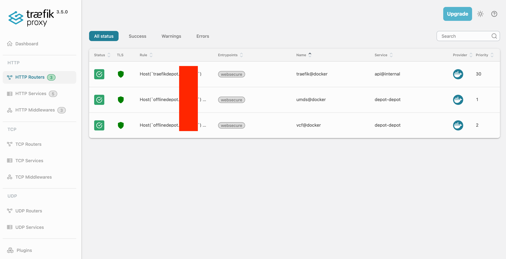

VCF router configuration:

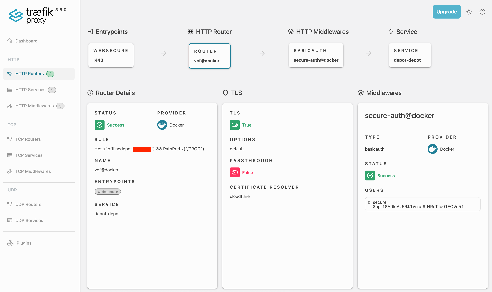

UMDS router configuration:

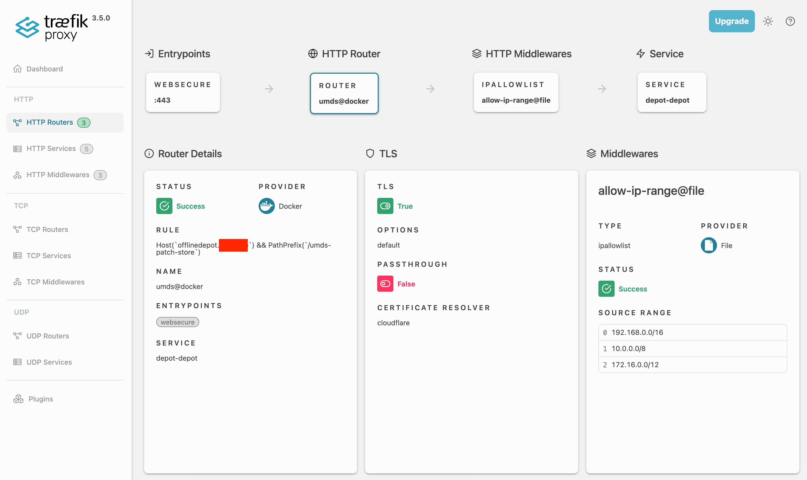


To verify that the depot is working correctly, access the following URLs:
- [https://depot.domain.com/umds-patch-store](https://depot.domain.com/umds-patch-store) (UMDS Depot)

> [!NOTE]
> This should allow you to access directly if your source IP address is part of the `allowiprange.yml`

- [https://depot.domain.com/PROD](https://depot.domain.com/PROD) (VCFOPS Depot)

> [!NOTE]
> This should prompt you for a username/password, use the credentials you set in the `$HOME/docker-compose/depot/docker-compose.yml` file.

Everything should now be ready for the VCF 9.0 installation process using a fully disconnected offline depot.


## Validating the Depot in VCF

Now we can set up the depot in VCF.

### Setting up the HTTPS Depot on VCF Installer (bootstrap)

Click on the `EDIT DEPOT CONNECTION` button and set up the HTTPS Depot.

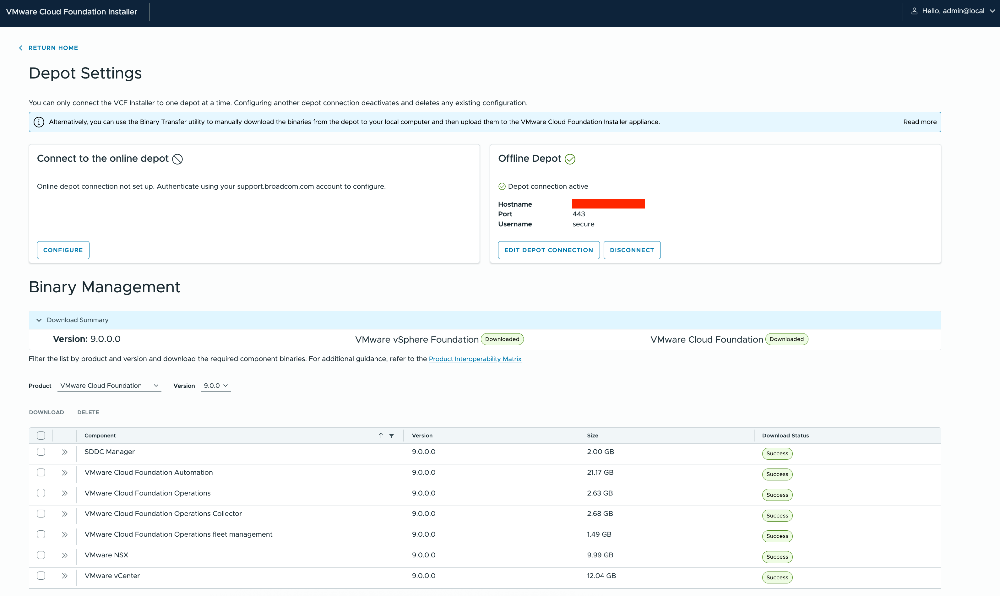

You can now deploy your VVF or VCF Instance after setting the HTTPS Depot and downloading the required components from it.

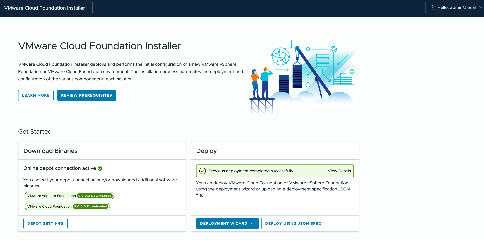


### Setting up the HTTPS Depot on VCF Operations Fleet Management (post-bootstrap)

By default, the HTTPS Depot is not enabled on the VCF Operations Fleet Management instance, but you can enable it as VCF 9 becomes a new "Unified Depot" model that covers all products.

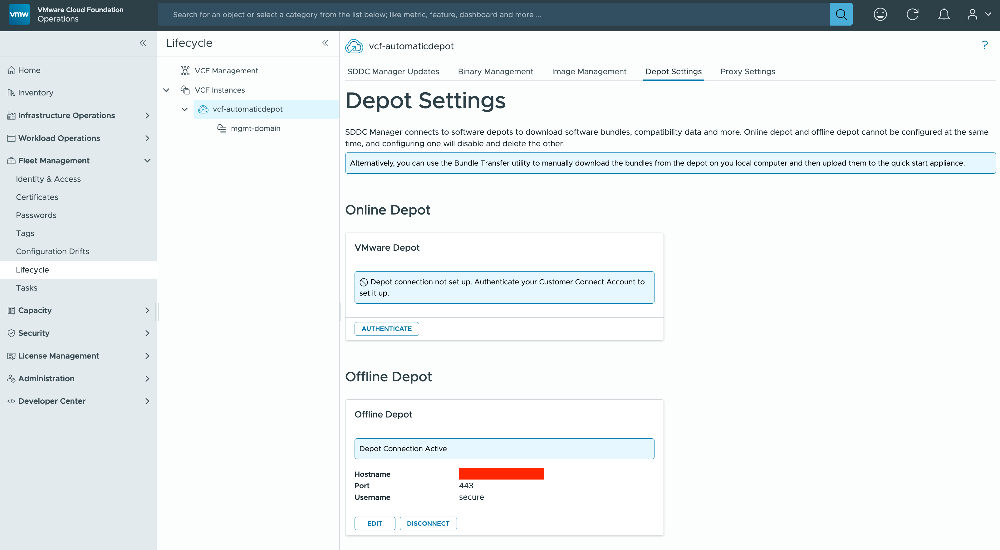

After setting it up, you'll see all products that VCF Fleet Manager can manage through its lifecycle.


### Synchronizing the ESXi Components for vSphere Updates

Log in to vSphere vCenter and navigate to the `Lifecycle Manager` section.

Verify that in the Settings section, the left menu `Download Sources` in the Admin section shows your SDDC Manager instance. (This is the default behavior when bootstrapping a VCF Instance)

It should show `Enabled` & `Connected` to the SDDC Manager instance. (The connectivity status takes a while to update)

Then click on the `Actions` button and select `Sync Updates`

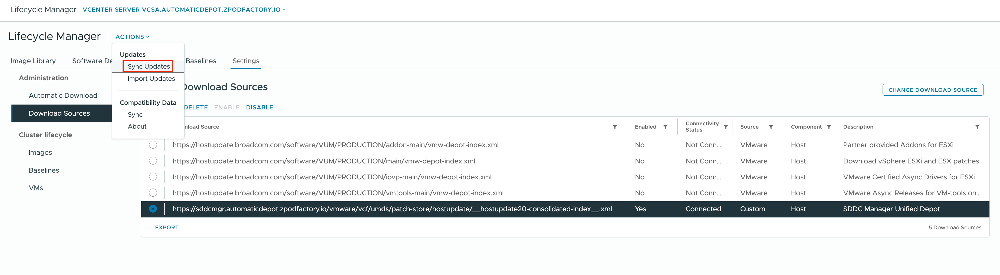

A task will be initiated and you can monitor it in the `Tasks` section.
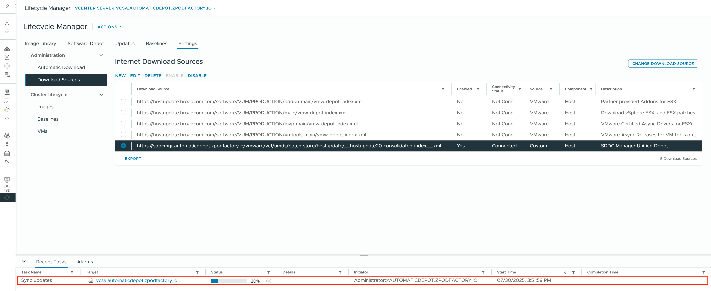

While this is happening you can check the `Software Depot` section, and at this point you should only see the current ESXi 9.0 version that was used to bootstrap the VCF Instance.

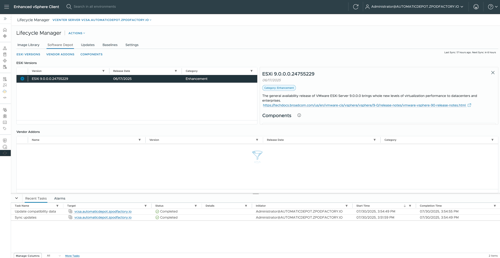

Once the task is complete, you can refresh the `Software Depot` section, and you should see all the images available in the UMDS depot.

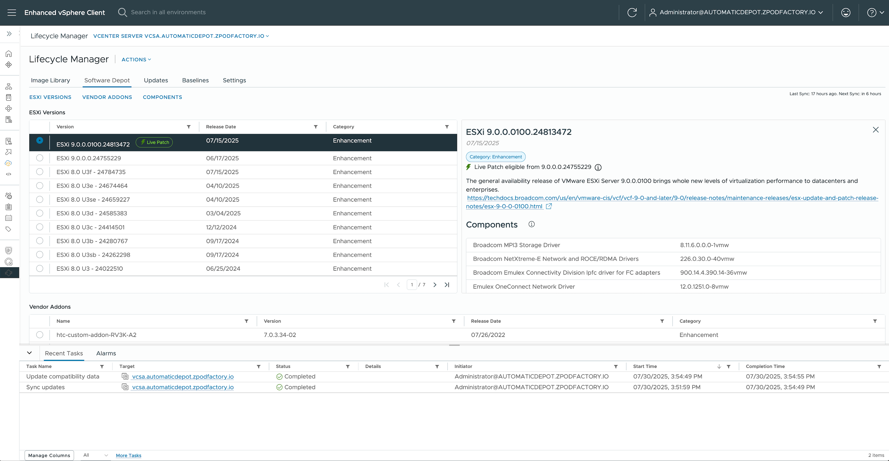

You can now set up a new `Cluster Image` in the `Image Library` for the latest 9.0.0.0100 patch that can be installed using the [Live Patch](https://techdocs.broadcom.com/us/en/vmware-cis/vsphere/vsphere/9-0/managing-host-and-cluster-lifecycle/configuring-vlcm-remediation-settings-1/how-to-apply-live-patches-to-the-hosts-in-a-cluster-managed-with-images.html) feature.

You will need to import that image into the VCF Operations `Image Management`, and then you can plan an upgrade through the VCF Operations lifecycle management process (pre-check, plan, etc.).

Refer to the [Managing vSphere Lifecycle Manager Images for VMware Cloud Foundation](https://techdocs.broadcom.com/us/en/vmware-cis/vcf/vcf-9-0-and-later/9-0/lifecycle-management/lifecycle-management-of-vcf-core-components/managing-vsphere-lifecycle-manager-images-for-vmware-cloud-foundation.html) and [Managing Host and Cluster Lifecycle](https://techdocs.broadcom.com/us/en/vmware-cis/vsphere/vsphere/9-0/managing-host-and-cluster-lifecycle.html) documentation for more details


---

## Adding VCF 9.0.1 Support

> [!NOTE]
> This section covers adding VCF 9.0.1 components to an existing VCF 9.0 offline depot.

### Updated Tooling

<!-- TBD: Update zBox version/download link if changed -->
Download the updated VCF download tool from the [Broadcom Support Portal](https://support.broadcom.com/group/ecx/productfiles?subFamily=VMware%20Cloud%20Foundation&displayGroup=VMware%20Cloud%20Foundation%209&release=9.0.1.0&os=&servicePk=&language=EN):

<!-- TBD: Update zBox version/download link if changed -->

```shell
❱ apt update && apt dist-upgrade -y
```

```shell
❱ tar -xvzf vcf-download-tool-9.0.1.0.24962179.tar.gz -C /usr/local
❱ rm vcf-download-tool-9.0.1.0.24962179.tar.gz
```

### Download VCF 9.0.1 Components

<!-- TBD: Update vcf-version and verify command output -->

Download all 9.0.1 components (install + upgrade) into the existing depot:

```shell
❱ vcf-download-tool binaries download --vcf-version 9.0.1 --depot-store /depot --depot-download-token-file /etc/broadcom-token
```


### Download vSphere 9.0.1 Updates with UMDS

> [!CAUTION]
> Updating the `vcf-download-tool` may overwrite the UMDS configuration. If so, you will need to re-run the UMDS installation and reconfigure it before downloading updates.

If the UMDS configuration was reset by the tooling update, redo the following steps:

```shell
# Re-install UMDS (go through the installer, enable/disable CEIP, accept eula)
❱ vcf-download-tool umds install
```

Then reconfigure UMDS by following all steps from the [Download vSphere Updates with UMDS](#download-vsphere-updates-with-umds) section again (entitlement token, patch store location, host version selection).

Once UMDS is configured, download the latest updates:

```shell
❱ /usr/local/vmware-umds/bin/vmware-umds -D
```

```shell
❱ chmod -R 755 /depot/umds-patch-store
```

You should now have all components for VCF 9.0.0 and 9.0.1 and the latest UMDS patches in your depot.

---

## Adding VCF 9.0.2 Support

> [!NOTE]
> This section covers adding VCF 9.0.2 components to an existing VCF 9.0/9.0.1 offline depot.

### Updated Tooling

Download the updated VCF download tool from the [Broadcom Support Portal](https://support.broadcom.com/group/ecx/productfiles?subFamily=VMware%20Cloud%20Foundation&displayGroup=VMware%20Cloud%20Foundation%209&release=9.0.2.0&os=&servicePk=&language=EN):

<!-- TBD: Update zBox version/download link if changed -->

```shell
❱ apt update && apt dist-upgrade -y
```

```shell
❱ tar -xvzf vcf-download-tool-9.0.2.0.25151284.tar.gz -C /usr/local
❱ rm vcf-download-tool-9.0.2.0.25151284.tar.gz
```

### Download VCF 9.0.2 Components

<!-- TBD: Update vcf-version and verify command output -->

Download all 9.0.2 components (install + upgrade) into the existing depot:

```shell
❱ vcf-download-tool binaries download --vcf-version 9.0.2 --depot-store /depot --depot-download-token-file /etc/broadcom-token
```


### Download vSphere 9.0.2 Updates with UMDS

> [!CAUTION]
> Updating the `vcf-download-tool` may overwrite the UMDS configuration. If so, you will need to re-run the UMDS installation and reconfigure it before downloading updates.

If the UMDS configuration was reset by the tooling update, redo the following steps:

```shell
# Re-install UMDS (go through the installer, enable/disable CEIP, accept eula)
❱ vcf-download-tool umds install
```

Then reconfigure UMDS by following all steps from the [Download vSphere Updates with UMDS](#download-vsphere-updates-with-umds) section again (entitlement token, patch store location, host version selection).

Once UMDS is configured, download the latest updates:

```shell
❱ /usr/local/vmware-umds/bin/vmware-umds -D
```

```shell
❱ chmod -R 755 /depot/umds-patch-store
```

You should now have all components for VCF 9.0.0, 9.0.1 and 9.0.2 and the latest UMDS patches in your depot.
